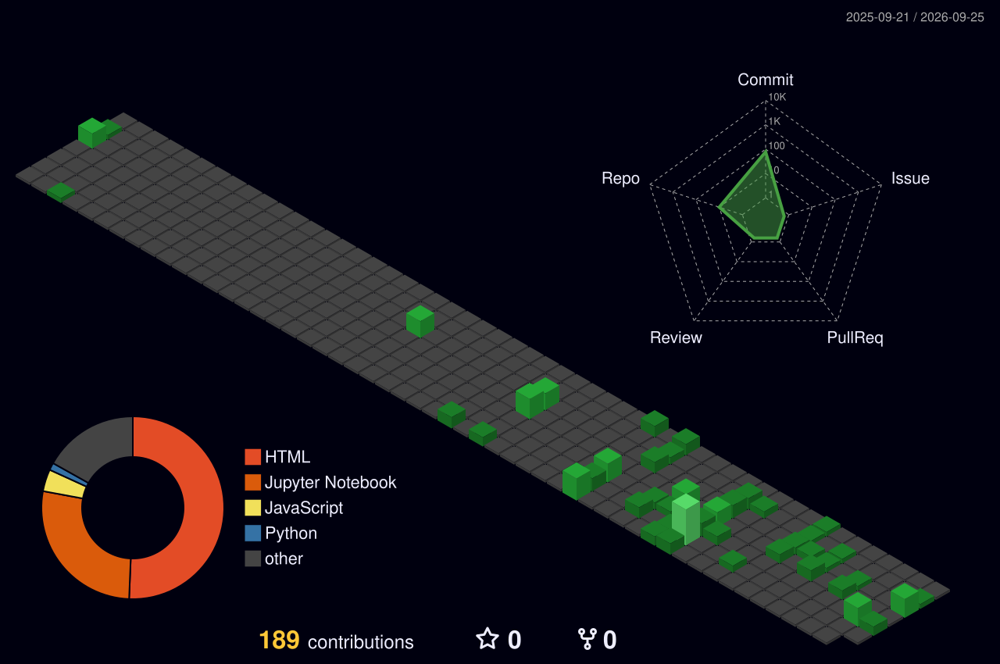

<h1 align="center">
  
</h1>

  <i>Crafting code from the shadows — one commit at a time.</i> 
  

  

## 🧬 Tech Stack

<table align="center" border="0" cellspacing="0" cellpadding="0" style="border-collapse: collapse; border: none;">
  <tr style="border: none;">
    <td align="center" valign="middle" width="50%" style="border: none; background: transparent;">
      
    </td>
    <td align="center" valign="middle" width="50%" style="border: none; background: transparent;">
      <marquee direction="left" scrollamount="7" behavior="scroll">
        &nbsp;
        &nbsp;
        &nbsp;
        &nbsp;
        &nbsp;
        &nbsp;
        &nbsp;
        &nbsp;
        &nbsp;
      </marquee>
    </td>
  </tr>
</table>

## 🚀 Featured Projects

<table align="center" border="0" cellspacing="0" cellpadding="0" style="border-collapse: collapse; border: none;">
  <tr style="border: none;">
    <td align="center" width="50%" style="border: none;">
      <h3>🧬 Neodia</h3>
      
All-in-one AKTU prep platform — notes, PYQs, and resources in one place.

      
    </td>
    <td align="center" width="50%" style="border: none;">
      <h3>🎯 Attendance Pro</h3>
      
Attendance tracking app built with Python & Django.

      
    </td>
  </tr>
  <tr style="border: none;">
    <td align="center" width="50%" style="border: none;">
      <h3>📸 Poloroider</h3>
      
Turn your pictures into Polaroids. Built with Java SpringBoot.

      
    </td>
    <td align="center" width="50%" style="border: none;">
      <h3>🏦 Kosh</h3>
      
All-in-one banking app — from the campus, for the campus.

      
    </td>
  </tr>
</table>

## 🌌 Footprints in the Cosmos

  

## 🐍 The Serpent's Trail

  <picture>
    <source media="(prefers-color-scheme: light)" srcset="https://raw.githubusercontent.com/YashPratap17/YashPratap17/output/github-snake.svg" />
    <source media="(prefers-color-scheme: dark)" srcset="https://raw.githubusercontent.com/YashPratap17/YashPratap17/output/github-snake-dark.svg" />
    
  </picture>

